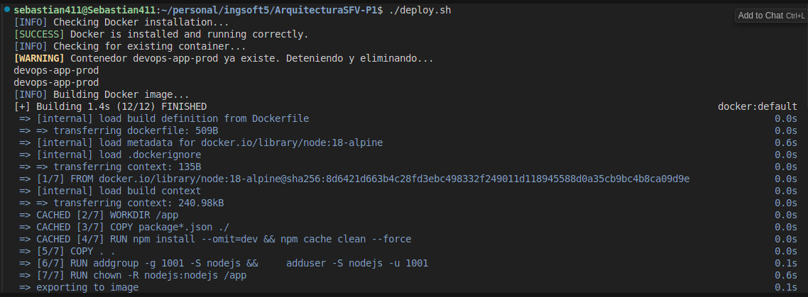
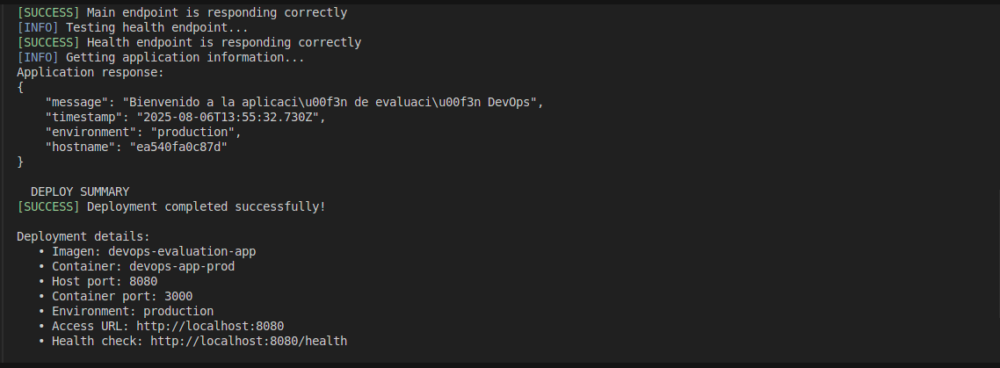

# ArquitecturaSFV-P1

# Evaluación Práctica - Ingeniería de Software V

## Información del Estudiante
- **Nombre:** Juan Sebastian Diaz Sanchez   
- **Código:** A00395098
- **Fecha:** 06/08/2025

## Resumen de la Solución

Esta implementación demuestra la aplicación práctica de principios DevOps mediante la contenerización de una aplicación Node.js y la automatización completa del proceso de despliegue. La solución incluye:

- **Contenerización completa** con Docker 
- **Script de automatización** que verifica, construye, despliega y valida la aplicación
- **Variables de entorno** pensadas para diferentes ambientes
- **Health checks** integrados para monitoreo de la aplicación
- **Documentación completa** con principios DevOps y decisiones técnicas

La aplicación es un servidor Express.js simple que expone endpoints para evaluación de salud y información del sistema, perfecta para demostrar conceptos de DevOps y contenerización.

## Dockerfile

### Decisiones Técnicas Tomadas

#### **1. Imagen Base: `node:18-alpine`**
- **Razón**: Alpine Linux proporciona una imagen base extremadamente ligera (~5MB vs ~300MB de Ubuntu)
- **Beneficio**: Reducción significativa del tamaño de imagen y tiempo de descarga
- **Consideración**: Node.js 18 LTS para estabilidad y soporte a largo plazo

#### **2. Usuario No-Root**
```dockerfile
RUN addgroup -g 1001 -S nodejs && \
    adduser -S nodejs -u 1001
USER nodejs
```
- **Razón**: Seguridad - ejecutar como usuario no privilegiado
- **Beneficio**: Reduce la superficie de ataque en caso de compromiso
- **Estándar**: Siguiendo las mejores prácticas de seguridad de contenedores

#### **3. Optimización de Capas**
```dockerfile
COPY package*.json ./
RUN npm install --omit=dev && npm cache clean --force
COPY . .
```
- **Razón**: Aprovechar el cache de Docker para capas de dependencias
- **Beneficio**: Reconstrucciones más rápidas cuando solo cambia el código
- **Técnica**: Separar instalación de dependencias de copia de código

#### **4. Health Check Integrado**
```dockerfile
HEALTHCHECK --interval=30s --timeout=3s --start-period=5s --retries=3 \
  CMD node -e "require('http').get('http://localhost:3000/health', (res) => { process.exit(res.statusCode === 200 ? 0 : 1) })"
```
- **Razón**: Monitoreo automático de la salud de la aplicación
- **Beneficio**: Docker puede detectar automáticamente si la aplicación falla
- **Configuración**: Intervalos apropiados para detección temprana de problemas

## Script de Automatización

### Funcionalidades Implementadas

El script `deploy.sh` implementa un pipeline de despliegue completo con las siguientes características:

#### **1. Verificación de Prerequisitos**
- Comprobación de instalación de Docker
- Verificación de que Docker esté ejecutándose
- Manejo de errores con mensajes claros y códigos de salida apropiados

#### **2. Gestión de Recursos**
- Limpieza automática de contenedores existentes
- Manejo de conflictos de nombres y puertos
- Cleanup automático en caso de errores

#### **3. Construcción y Despliegue**
- Construcción automática de imagen Docker
- Configuración de variables de entorno (PORT=3000, NODE_ENV=production)
- Mapeo de puertos (8080:3000) según especificaciones

#### **4. Validación Automática**
- Pruebas de conectividad HTTP
- Verificación de endpoints principales y de salud
- Validación de respuestas JSON
- Timeouts configurados para evitar bloqueos

#### **5. Reporte de Estado**
- Resumen detallado del despliegue
- Información de configuración y acceso
- Comandos útiles para gestión posterior

### Características Técnicas

- **Manejo de errores robusto** con cleanup automático
- **Salida con colores** para mejor legibilidad
- **Compatibilidad multiplataforma** (Linux, macOS)
- **Configuración centralizada** mediante variables
- **Logging estructurado** para debugging

## Principios DevOps Aplicados

### **1. Automatización (Automation)**
- **Implementación**: Script de despliegue completamente automatizado
- **Beneficio**: Eliminación de errores humanos y consistencia en despliegues
- **Aplicación**: Desde verificación de prerequisitos hasta validación final

### **2. Integración Continua (CI)**
- **Implementación**: Pipeline automatizado de build → test → deploy
- **Beneficio**: Detección temprana de problemas y despliegues confiables
- **Aplicación**: Construcción automática de imagen y validación de funcionalidad

### **3. Infraestructura como Código (IaC)**
- **Implementación**: Dockerfile versionado y script de automatización
- **Beneficio**: Reproducibilidad y consistencia en diferentes ambientes
- **Aplicación**: Configuración de contenedor y variables de entorno como código

### **4. Monitoreo y Observabilidad**
- **Implementación**: Health checks integrados y endpoints de monitoreo
- **Beneficio**: Detección proactiva de problemas y visibilidad del estado
- **Aplicación**: Endpoint `/health` y health check de Docker

### **5. Seguridad por Diseño**
- **Implementación**: Usuario no-root, imagen base minimalista
- **Beneficio**: Reducción de superficie de ataque y mejores prácticas
- **Aplicación**: Contenedor ejecutándose como usuario no privilegiado

### **6. Gestión de Configuración**
- **Implementación**: Variables de entorno para diferentes ambientes
- **Beneficio**: Flexibilidad para despliegues en diferentes entornos
- **Aplicación**: NODE_ENV y PORT configurables

## Decisiones Técnicas Documentadas

### **Arquitectura de Contenedor**
- **Decisión**: Contenedor monolítico vs microservicios
- **Razón**: Aplicación simple que no requiere descomposición
- **Beneficio**: Simplicidad de despliegue y mantenimiento

### **Gestión de Dependencias**
- **Decisión**: `npm install --omit=dev` vs `npm ci`
- **Razón**: Flexibilidad sin requerir package-lock.json
- **Beneficio**: Funciona en diferentes entornos de desarrollo

### **Configuración de Puertos**
- **Decisión**: Puerto 8080 externo, 3000 interno
- **Razón**: Evitar conflictos con servicios comunes (80, 443, 3000)
- **Beneficio**: Flexibilidad para múltiples despliegues

### **Estrategia de Health Check**
- **Decisión**: HTTP health check vs proceso simple
- **Razón**: Validación real de funcionalidad de la aplicación
- **Beneficio**: Detección de problemas de conectividad y lógica

## Captura de Pantalla

### Estado del Contenedor y Aplicación Funcionando




## Mejoras Futuras

### **1. Integración con CI/CD Pipeline**
- **Descripción**: Integrar el script con GitHub Actions, GitLab CI, o Jenkins
- **Beneficios**: 
  - Despliegue automático en cada commit
  - Validación automática de pull requests
  - Rollback automático en caso de fallos
- **Implementación**: Crear workflows de CI/CD con testing automatizado

### **2. Orquestación con Docker Compose**
- **Descripción**: Migrar a Docker Compose para gestión de múltiples servicios
- **Beneficios**:
  - Gestión simplificada de dependencias
  - Configuración centralizada
  - Escalabilidad horizontal
- **Implementación**: Crear `docker-compose.yml` con servicios de aplicación, base de datos, y monitoreo

### **3. Monitoreo y Logging Avanzado**
- **Descripción**: Implementar sistema de monitoreo con Prometheus y Grafana
- **Beneficios**:
  - Métricas en tiempo real
  - Alertas automáticas
  - Dashboards de visualización
- **Implementación**: Agregar exporters de métricas y configuración de alertas

### **4. Escalabilidad y Load Balancing**
- **Descripción**: Implementar escalabilidad horizontal con balanceador de carga
- **Beneficios**:
  - Alta disponibilidad
  - Mejor rendimiento
  - Tolerancia a fallos
- **Implementación**: Usar Kubernetes o Docker Swarm con nginx como load balancer

### **6. Testing Automatizado**
- **Descripción**: Agregar suite completa de pruebas automatizadas
- **Beneficios**:
  - Calidad de código mejorada
  - Detección temprana de regresiones
  - Confianza en despliegues
- **Implementación**: Unit tests, integration tests, y end-to-end tests

## Instrucciones para Ejecutar

### Prerequisitos
- Docker instalado y ejecutándose
- Bash shell (Linux/macOS)
- Conexión a internet

### Pasos de Ejecución

#### **1. Clonar el Repositorio**
```bash
git clone <repository-url>
cd ArquitecturaSFV-P1
```

#### **2. Verificar Docker**
```bash
docker --version
docker info
```

#### **3. Ejecutar el Script de Automatización**
```bash
chmod +x deploy.sh
./deploy.sh
```

#### **4. Verificar el Despliegue**
```bash
# Verificar contenedor ejecutándose
docker ps | grep devops-app-prod

# Probar endpoint principal
curl http://localhost:8080

# Probar endpoint de health
curl http://localhost:8080/health
```

#### **5. Ver Logs (Opcional)**
```bash
docker logs devops-app-prod
```

### Comandos de Gestión

#### **Detener la Aplicación**
```bash
docker stop devops-app-prod
```

#### **Eliminar Contenedor**
```bash
docker rm devops-app-prod
```

#### **Reconstruir y Redesplegar**
```bash
./deploy.sh
```

### Troubleshooting

#### **Error: Puerto 8080 en uso**
```bash
# Cambiar puerto en deploy.sh
HOST_PORT=8081
```

#### **Error: Docker no ejecutándose**
```bash
# En Linux
sudo systemctl start docker

# En macOS
open -a Docker
```

#### **Error: Permisos de script**
```bash
chmod +x deploy.sh
```