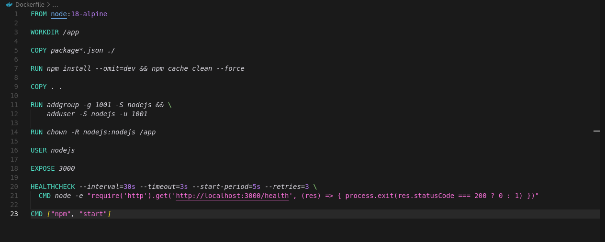
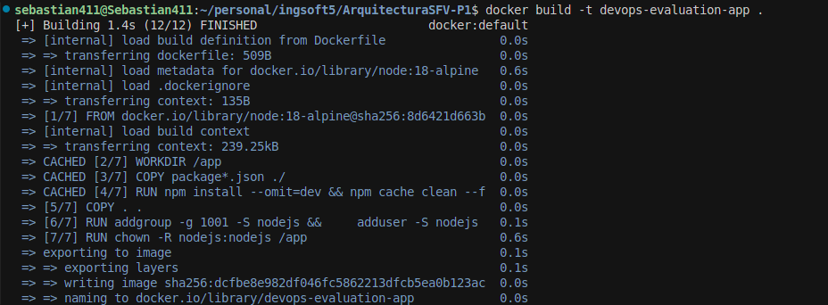
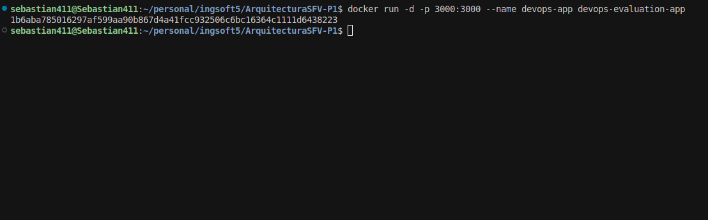
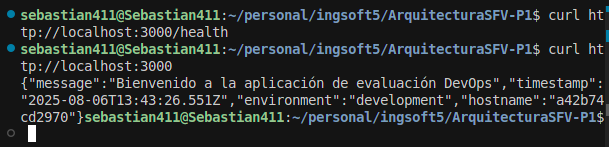
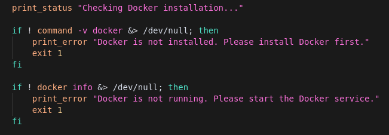
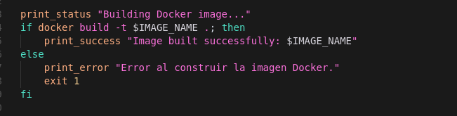
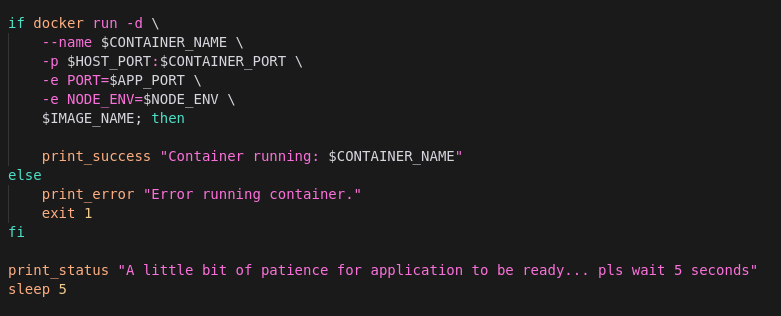
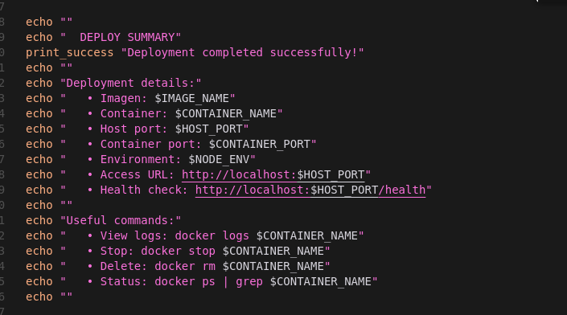
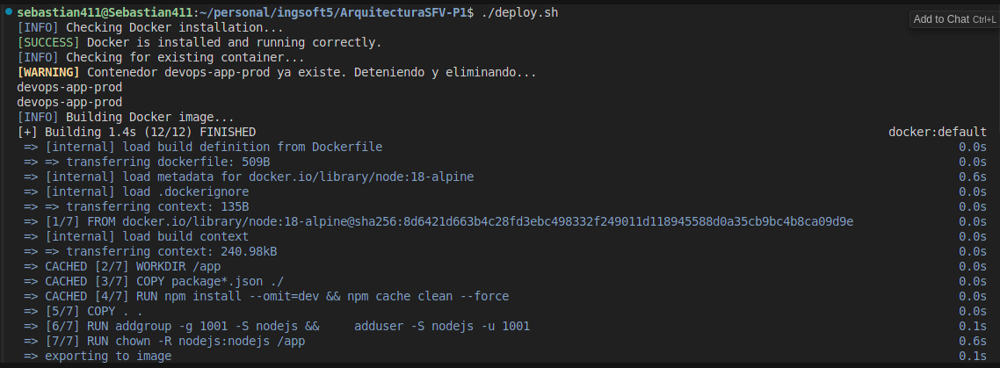
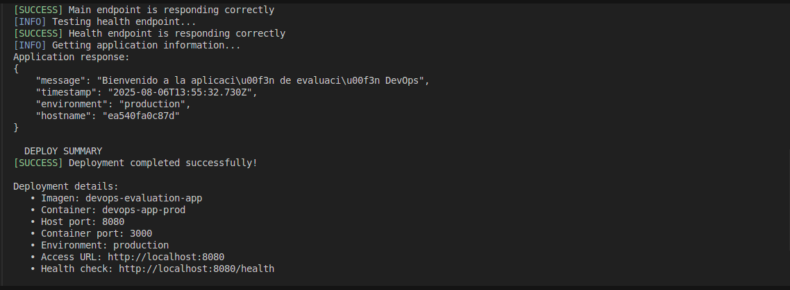

### 1. Contenerización (40%)
- Crear un Dockerfile para la aplicación Node.js proporcionada

- Construir una imagen de Docker

- Ejecutar un contenedor a partir de la imagen

- Verificar que la aplicación funciona correctamente

### 2. Script de Automatización (40%)
Desarrollar un script (bash o PowerShell) que:
- Verifique si Docker está instalado

- Construya la imagen automáticamente

- Ejecute el contenedor con las variables de entorno adecuadas (PORT=8080 y NODE_ENV=production)

- Realice una prueba básica para verificar que el servicio responde (por ejemplo, curl o wget)

- Imprima un resumen del estado (éxito o error)

- Imprima un resumen del estado (éxito o error)

